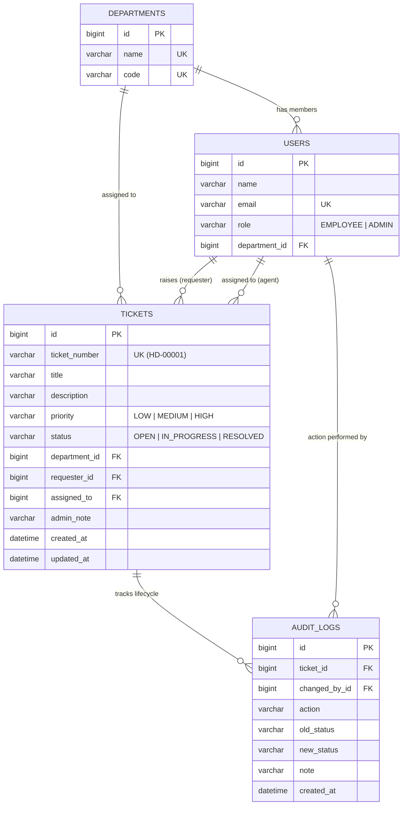

# HelpDeskHub — Enterprise IT Service Desk Management System

An internal IT Help Desk Ticket Management System designed with a normalized relational database (in 3NF) for employees to report workplace IT issues across departments, and for administrators to manage ticket resolution, track SLA metrics, and maintain a complete audit trail.

---

## Technical Highlights (Capgemini Analyst Focus)

- **Relational DBMS & SQL (in 3NF)**:
  - Normalized schema across 4 tables: `departments`, `users`, `tickets`, and `audit_logs`.
  - Eliminates data duplication: tickets reference department IDs rather than duplicating department names.
  - Foreign key constraints (`ON DELETE CASCADE`, `ON DELETE RESTRICT`, `ON DELETE SET NULL`) maintaining relational integrity.
  - B-Tree indexes on `department_id`, `assigned_to`, `status`, `priority`, and `created_at`.
- **Java OOP Architecture**:
  - Encapsulated JPA entities, immutable DTO records (`CreateTicketRequest`, `TicketResponse`, `AuditLogResponse`), service-layer business logic, and repository abstractions.
- **RESTful API (8 Endpoints)**:
  - Ticket submission, department listing, indexed filtering, ticket tracking by ticket number, status transitions, and dashboard metrics.
- **Security & RBAC**:
  - Public ticket submission and status tracking.
  - HTTP Basic authentication with BCrypt password hashing for administrative actions.
- **Audit Trail & Observability**:
  - Automatically logs every lifecycle transition (`CREATED`, `STATUS_UPDATED`, `NOTE_UPDATED`) to an immutable `audit_logs` table.
- **Modern Responsive Frontend**:
  - React 19, Vite, clean CSS, real-time ticket tracking, and interactive lifecycle timeline modal.

---

## Database Schema (3NF)



---

## 8 RESTful Endpoints

| # | Method | Endpoint | Purpose | Access |
| :---: | :--- | :--- | :--- | :--- |
| **1** | `POST` | `/api/tickets` | Submit a ticket with department, priority, and description | Public |
| **2** | `GET` | `/api/tickets` | List and filter tickets (by department, status, priority) | Admin |
| **3** | `GET` | `/api/tickets/{id}` | Get ticket details and complete audit timeline | Admin |
| **4** | `GET` | `/api/tickets/track/{ticketNumber}` | Public employee lookup to track ticket resolution status | Public |
| **5** | `PUT` | `/api/tickets/{id}` | Update status (`IN_PROGRESS` → `RESOLVED`), log note, assign agent | Admin |
| **6** | `DELETE` | `/api/tickets/{id}` | Remove test ticket (cascades audit records) | Admin |
| **7** | `GET` | `/api/departments` | Fetch departments for submission dropdown | Public |
| **8** | `GET` | `/api/dashboard/summary` | Aggregate dashboard metrics and department workload | Admin |

*(Bonus)* `GET /api/health` — System uptime and status check (Public).

---

## Run Locally

### Prerequisites
- Java 21 (Temurin JDK 21 recommended)
- Maven 3.9+
- Node.js (v18+) and npm
- MySQL 8 (optional; an in-memory dev profile is pre-configured for instant offline running)

### 1. Start the Backend (API)
```powershell
cd backend

# Option A: Instant offline run with in-memory H2 dev profile (zero external setup needed)
mvn spring-boot:run "-Dspring-boot.run.profiles=dev"

# Option B: Run with local MySQL (ensure database/schema.sql has been executed)
mvn spring-boot:run
```
The API starts at `http://localhost:8080`.

### 2. Start the Frontend
In a second terminal:
```powershell
cd frontend
npm install
npm run dev
```
Open **`http://localhost:5173`** in your browser.

- **Admin Credentials**: `admin` / `ChangeMe123!`

---

## Deploy Live Online (Permanent Free Hosting)

You can host this full-stack application online permanently with zero cost:

### 1. Deploy to Render (Recommended for Spring Boot + React)
1. Sign in to [Render.com](https://render.com) using your GitHub account (`DivyanshWatma29`).
2. Click **New +** $\rightarrow$ **Blueprint**.
3. Select your repository: `DivyanshWatma29/HelpDeskHub`.
4. Render automatically reads `render.yaml`, spins up the **Spring Boot API** and the **React Frontend**, and assigns permanent HTTPS URLs (e.g. `https://helpdeskhub.onrender.com`).

### 2. Deploy Frontend to Vercel (Alternative)
1. Sign in to [Vercel.com](https://vercel.com) with GitHub.
2. Click **Add New Project** $\rightarrow$ select `HelpDeskHub`.
3. Set **Root Directory** to `frontend`.
4. Add Environment Variable: `VITE_API_BASE=https://<your-render-backend-url>/api`.
5. Click **Deploy** to get an instant live frontend URL (e.g. `https://helpdeskhub.vercel.app`).

---

## Interview Preparation Guide (Capgemini Analyst Role)

### Your Role Script (What to tell the interviewer)
> *"I worked as the Backend & Database Developer on this project. I designed the normalized relational database schema in MySQL (in 3NF) across `departments`, `users`, `tickets`, and `audit_logs` tables to eliminate data redundancy.
> 
> I developed 8 RESTful API endpoints in Spring Boot with Java OOP patterns to handle ticket creation, department filtering, status transitions, and audit tracking.
> 
> To prevent query slowdowns during admin searches across large datasets, I implemented B-Tree indexes on foreign key and lookup columns (`department_id`, `assigned_to`, `status`, `priority`), ensuring $O(\log N)$ search performance. I also authored multi-table `INNER JOIN` queries for operational dashboards to analyze department workload and SLA resolution times."*

### Key Interview Topics Covered
1. **DBMS & Normalization (3NF)**:
   - *Why 3NF?* Instead of storing department names and codes redundantly in every ticket row, we store a `department_id` foreign key referencing the `departments` table.
2. **SQL `INNER JOIN` Queries**:
   - See `database/reporting-queries.sql` for real queries joining `tickets`, `users`, `departments`, and `audit_logs`.
3. **Database Indexing**:
   - B-Tree indexes on lookup columns prevent full-table scans.
4. **REST API & HTTP Status Codes**:
   - `200 OK`, `201 Created`, `204 No Content`, `400 Bad Request`, `401 Unauthorized`, `404 Not Found`.
5. **Java OOP**:
   - Encapsulation (Entities & DTOs), Abstraction (Repositories extending `JpaRepository`), Polymorphism (Dependency Injection).
