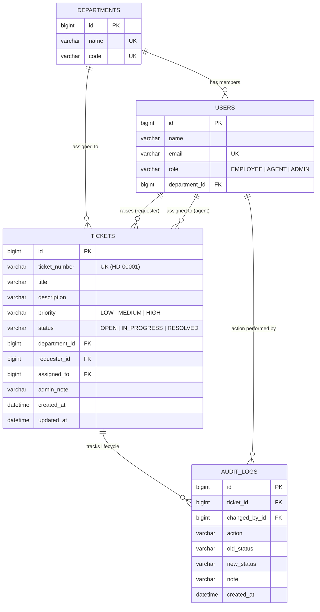

# HelpDeskHub — IT Service Desk Management System

An internal IT Help Desk Ticket Management System designed with a normalized relational database (in 3NF) for employees to report workplace IT issues across departments, and for support teams to manage ticket resolution, track status workflows, and maintain a complete audit trail.

> 🌐 **Live Demo**: [https://helpdeskhub-frontend.onrender.com](https://helpdeskhub-frontend.onrender.com)  
> ⚡ **API Service**: [https://helpdeskhub-api.onrender.com/api/health](https://helpdeskhub-api.onrender.com/api/health)  
> 📁 **GitHub Repository**: [https://github.com/DivyanshWatma29/HelpDeskHub](https://github.com/DivyanshWatma29/HelpDeskHub)

---

## Features & Architecture

- **Relational DBMS & SQL (3NF Normalized)**:
  - Normalized schema across 4 tables: `departments`, `users`, `tickets`, and `audit_logs`.
  - Eliminates data duplication: tickets reference department IDs rather than duplicating department names.
  - Foreign key constraints (`ON DELETE CASCADE`, `ON DELETE RESTRICT`, `ON DELETE SET NULL`) maintaining relational integrity.
  - B-Tree indexes on `department_id`, `assigned_to`, `status`, `priority`, and `created_at`.
- **Java OOP Architecture**:
  - Encapsulated JPA entities, immutable DTO records (`CreateTicketRequest`, `TicketResponse`, `AuditLogResponse`), service-layer business logic, and repository abstractions.
- **RESTful API (8 Endpoints)**:
  - Ticket submission, department listing, indexed filtering, ticket tracking by ticket number, status transitions, and dashboard metrics.
- **Security & Role-Based Access Control**:
  - Public ticket submission and status tracking.
  - Role separation: Support Agents can manage tickets; Administrators can delete and manage users.
  - HTTP Basic authentication with BCrypt password hashing.
- **Audit Trail & Observability**:
  - Automatically logs every lifecycle transition (`CREATED`, `STATUS_UPDATED`, `NOTE_UPDATED`) to an immutable `audit_logs` table.
- **Modern Responsive Frontend**:
  - React 19, Vite, clean CSS, real-time ticket tracking, and interactive lifecycle timeline modal.

---

## Database Schema (3NF)



---

## RESTful API Endpoints

| # | Method | Endpoint | Purpose | Access |
| :---: | :--- | :--- | :--- | :--- |
| **1** | `POST` | `/api/tickets` | Submit a ticket with department, priority, and description | Public |
| **2** | `GET` | `/api/tickets` | List and filter tickets (by department, status, priority) | Agent / Admin |
| **3** | `GET` | `/api/tickets/{id}` | Get ticket details and complete audit timeline | Agent / Admin |
| **4** | `GET` | `/api/tickets/track/{ticketNumber}` | Public employee lookup to track ticket resolution status | Public |
| **5** | `PUT` | `/api/tickets/{id}` | Update status (`IN_PROGRESS` → `RESOLVED`), log note | Agent / Admin |
| **6** | `DELETE` | `/api/tickets/{id}` | Remove ticket (cascades audit records) | Admin Only |
| **7** | `GET` | `/api/departments` | Fetch departments for submission dropdown | Public |
| **8** | `GET` | `/api/dashboard/summary` | Aggregate dashboard metrics and department workload | Agent / Admin |

*(System)* `GET /api/health` — System uptime and status check (Public).

---

## Run Locally

### Prerequisites
- Java 21 (Temurin JDK 21 recommended)
- Maven 3.9+
- Node.js (v18+) and npm
- MySQL 8 (optional; an in-memory dev profile is pre-configured for instant offline running)

### 1. Start the Backend (API)
```powershell
cd backend

# Option A: Instant offline run with in-memory H2 dev profile (zero external setup needed)
mvn spring-boot:run "-Dspring-boot.run.profiles=dev"

# Option B: Run with local MySQL (ensure database/schema.sql has been executed)
mvn spring-boot:run
```
The API starts at `http://localhost:8080`.

### 2. Start the Frontend
In a second terminal:
```powershell
cd frontend
npm install
npm run dev
```
Open **`http://localhost:5173`** in your browser.

### Credentials
- **Administrator**: `admin` / `ChangeMe123!`
- **Support Agent**: `agent` / `Agent123!`
